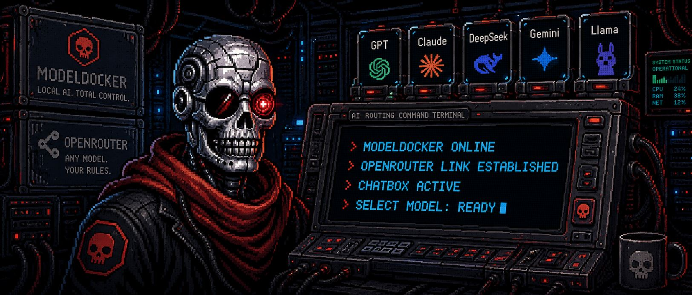
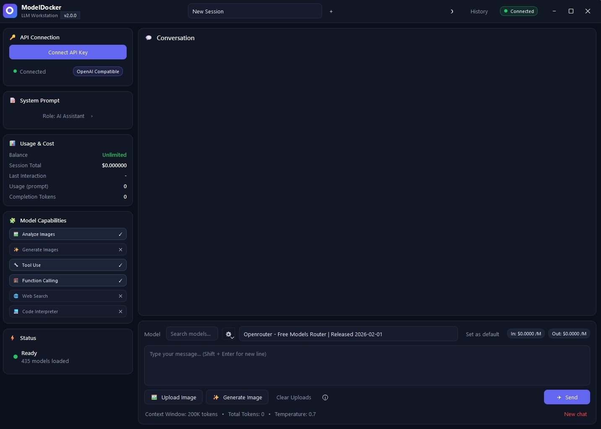

# ModelDocker

**A Windows desktop AI chat client for OpenRouter.**

ModelDocker gives you a clean local desktop interface for chatting with OpenRouter models, managing conversations, switching themes, and working with model capabilities from one app.



## Screenshot



## Download

Download the Windows executable:

**[ModelDocker.exe](dist/ModelDocker.exe)**

Run the file, enter your [OpenRouter API key](https://openrouter.ai/keys), choose a model, and start chatting.

> Note: For public releases, GitHub Releases are usually the best place to attach `ModelDocker.exe`. The file is also kept in `dist/` for this repo.

## Highlights

- **OpenRouter desktop client** with streaming chat completions.
- **Model browser** with search, capability hints, pricing, and context information.
- **Multi-session history** so conversations can be reopened, renamed, or deleted.
- **Power-user composer** with model filters, temperature control, attachments, image actions, and video actions where supported.
- **Dark and light themes** with settings saved locally.
- **Local conversation storage** under `%USERPROFILE%\.modeldocker\`.

## Quick Start

### Use the app

1. Download **[dist/ModelDocker.exe](dist/ModelDocker.exe)**.
2. Double-click the executable.
3. Paste your OpenRouter API key when prompted.
4. Pick a model and chat.

### Run from source

```powershell
git clone https://github.com/Skynet-Pro-Plus/modeldocker.git
cd modeldocker
python -m venv .venv
.\.venv\Scripts\Activate.ps1
pip install -r requirements.txt
python main.py
```

For a no-console launch on Windows, run `ModelDocker.bat` or `launch.pyw`.

## Privacy

- Your OpenRouter API key is validated with OpenRouter and is not sent anywhere else by ModelDocker.
- On Windows, the key is stored through Windows Credential Manager via `keyring` when available.
- If Credential Manager is unavailable, a local fallback file is used at `%USERPROFILE%\.modeldocker\config.json`.
- Sessions and preferences are stored locally under `%USERPROFILE%\.modeldocker\`.

## Build the Windows Exe

To rebuild `dist\ModelDocker.exe`:

```powershell
pip install -r requirements.txt -r requirements-build.txt
.\build_onefile.ps1
```

The build uses `ModelDocker.spec` and expects `ICON.ico` in the repository root. PyInstaller's generated `build/` folder is intentionally ignored.

## Test

Run the headless smoke test:

```powershell
python smoke_test.py
```

## Project Layout

| Path | Purpose |
| --- | --- |
| `main.py` | Console entry point |
| `launch.pyw` | No-console Windows launcher |
| `ModelDocker.bat` | Double-click launcher |
| `openrouter_client.py` | OpenRouter API client |
| `settings_store.py` | API key and preference storage |
| `session_store.py` | Local chat session storage |
| `ui/` | PySide6 interface |
| `ModelDocker.spec` | PyInstaller build recipe |
| `build_onefile.ps1` | One-command exe build |

## Contributing

See [CONTRIBUTING.md](CONTRIBUTING.md) for setup, test, and build notes.

## License

ModelDocker is released under the [MIT License](LICENSE).
